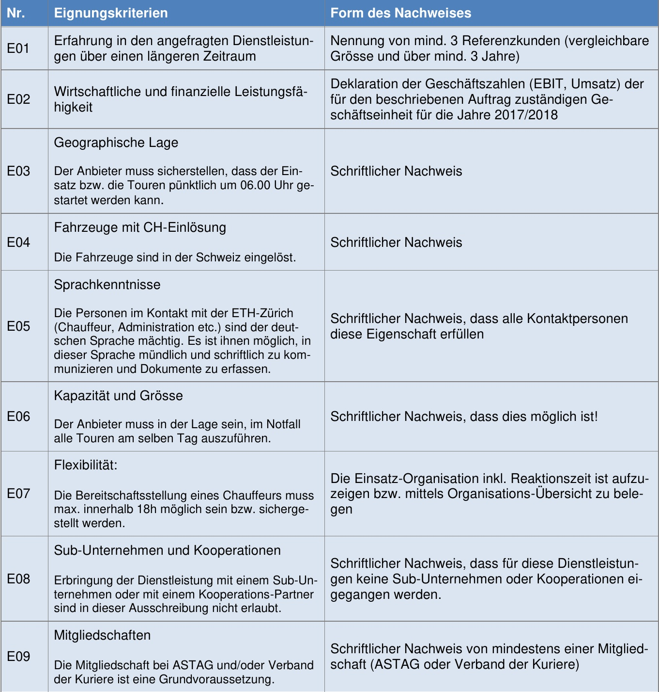
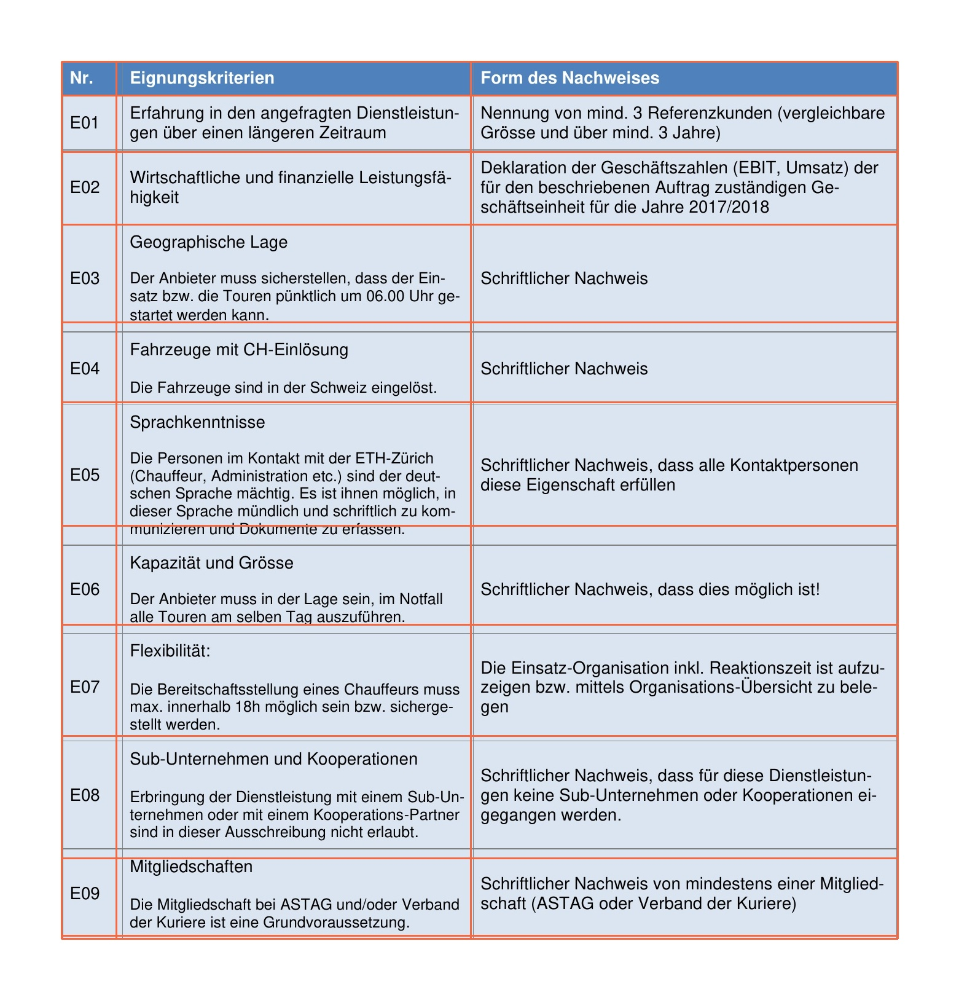
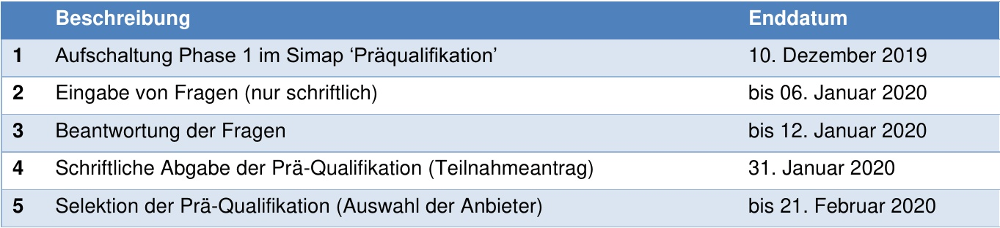
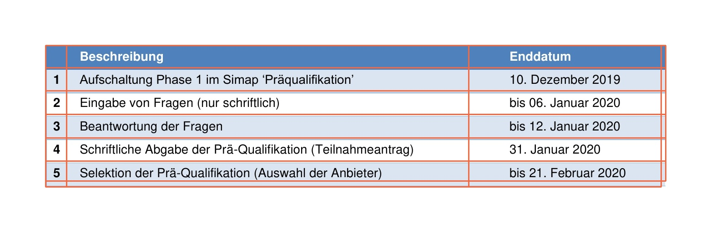
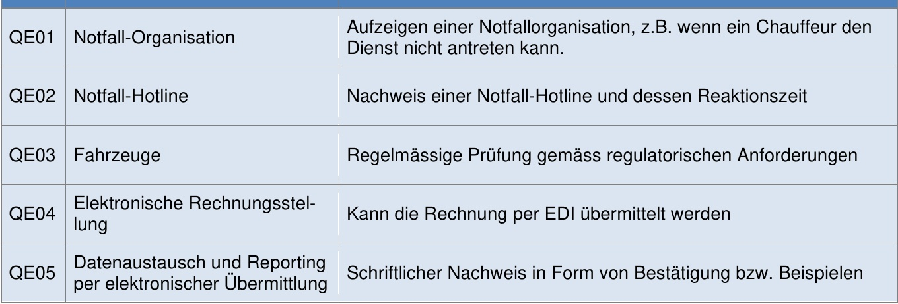
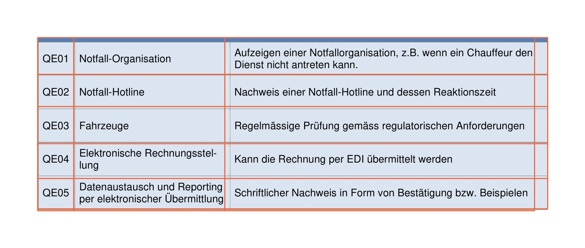

> :warning: **25/05/2022 Read before using**: this repo will be updated in the future. Note that you should not use this code if you want to use all the features that the official repo has to offer. You could use it as a good example for inference, but you really shouldn't use our post-processing since the official repo does a much better job at this. I will try to add a simple example on how to do this in the future if they have not included it already.

# Table Transformer Simple Inference
This repository contains code to run simple inference and export the cells of a table (incl. text in cell), as a pandas DataFrame. Note that not all the features that the official repository offers are included. The resulting DataFrame is constructed based on the column and row predictions, and will probably not work on complex tables. The repo is built on top of [this](https://github.com/phamquiluan/table-transformer) fork of the official repo.

We worked with tables that were already cropped out, but you could also first apply table detection using the [pre-trained weights](https://pubtables1m.blob.core.windows.net/model/pubtables1m_detection_detr_r18.pth) from the official repo.

<p align="center">


</p>

<p align="center">


</p>

<p align="center">


</p>

## Setup Guide
You can refer to the environment.yml file to set up your environement with conda. We used a virtual environment, which means that you can either put all the requirements in the environment.yml file into a requirements.txt file or just install them manually.

### Create Virtual Environment

```bash
python -m virtualenv venv
source venv/bin/activate
```

### PyTorch
To install PyTorch you might be able to use the command below if your CUDA and Python version (3.8.10) overlap. If not, you can use the get [started guide](https://pytorch.org/get-started/locally/) to compose your install command.

```bash
pip install torch==1.10.2+cu113 torchvision==0.11.3+cu113 torchaudio==0.10.2+cu113 -f https://download.pytorch.org/whl/cu113/torch_stable.html
```

### Detectron2
Use the command below and if it doesn't work you can use the official [installation guide](https://detectron2.readthedocs.io/en/latest/tutorials/install.html)
```bash
pip install "detectron2@git+https://github.com/facebookresearch/detectron2.git@v0.5#egg=detectron2"
```

### PyTesseract
The Tesseract OCR Python wrapper is used for text recognition on each cell in the tables. For more information about the installation you can refer to the [pytesseract](https://github.com/madmaze/pytesseract) GitHub repo.

```bash
pip install pip install pytesseract
```

Next, you need to download additional language packs, although it might be that English is supported out of the box. You can download the language packs from either the [tessdata](https://github.com/tesseract-ocr/tessdata) or [tessdata_fast](https://github.com/tesseract-ocr/tessdata_fast) repository. Keep in mind that you have to make a speed/accuracy compromise when using the fast packs. 

You can either clone the whole repository or download a single pack. During development the (format=language:abbreviation:packname) English='eng'=eng.traineddata, French='fra'=fra.traineddata, and German='deu'=deu.traineddata lanaguage packs were used. 

Put the language packs in a directory called tessdata and set the TESSDATA_PREFIX environment variable like we do below.

```bash
export TESSDATA_PREFIX=/home/user/tessdata
```

### Pre-trained Model Weights
Assuming that you have already cropped out the table after table detection, you can use the pre-trained model below for table structure reocgnition. Put the model in the root of this repository after the download has finished or change the path to the model in the code.

<b>Table Structure Recognition:</b>
<table>
  <thead>
    <tr style="text-align: right;">
      <th>Model</th>
      <th>Schedule</th>
      <th>AP50</th>
      <th>AP75</th>
      <th>AP</th>
      <th>AR</th>
      <th>GriTS<sub>Top</sub></th>
      <th>GriTS<sub>Con</sub></th>
      <th>GriTS<sub>Loc</sub></th>
      <th>Acc<sub>Con</sub></th>
      <th>File</th>
      <th>Size</th>
    </tr>
  </thead>
  <tbody>
    <tr style="text-align: right;">
      <td>DETR R18</td>
      <td>20 Epochs</td>
      <td>0.970</td>
      <td>0.941</td>
      <td>0.902</td>
      <td>0.935</td>
      <td>0.9849</td>
      <td>0.9850</td>
      <td>0.9786</td>
      <td>0.8243</td>
      <td><a href="https://pubtables1m.blob.core.windows.net/model/pubtables1m_structure_detr_r18.pth">Weights</a></td>
      <td>110 MB</td>
    </tr>
  </tbody>
</table>


## Running Things Locally
You can run the main.py script which will use the 'example_table.jpg' as input to the model and output 'visualization.jpg' containing the visualization of the predictions on the original image.

```bash
python main.py
```

## Official Repository
The official repository can be found [here](https://github.com/microsoft/table-transformer). If you want to extract more complex tables you will have to add the appropriate post-processing yourself, but you can use the official source code as a reference. :)
